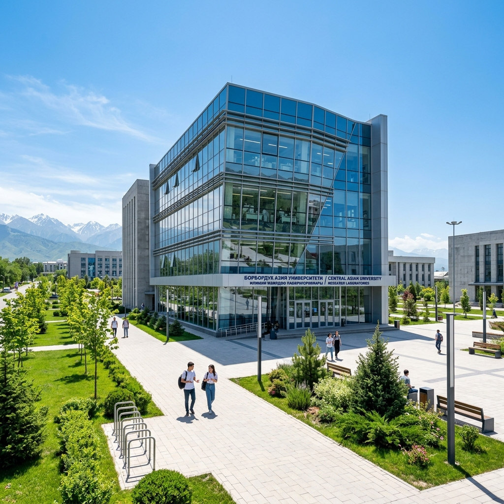

<section class="hero-section">
  

    

      
🎓 MBBS Intake 2026-2027 Open

      <h1 class="hero-title">Your Dream, Our Guidance, Global Success 🩺</h1>
      
Aspiring to wear the white coat? Secure guaranteed admission in top-ranked, globally recognized government medical universities with 100% transparency and complete support.

      

        <a href="#" class="btn btn-gold" data-trigger-enquiry>🚀 Get Free Counseling</a>
        <a href="#destinations" class="btn btn-emerald">Explore Destinations</a>
      

    

    

      
    

  

</section>

<section class="stats-section">
  

    

      

        
10+

        
Country Options

      

      

        
50+

        
Partner Universities

      

      

        
1000+

        
Students Counseled

      

      

        
100%

        
Admission Safety

      

    

  

</section>

<section id="destinations" class="section-container destinations-grid-container">
  

    <h2 class="section-title">Explore Medical Programs Globally 🌍</h2>
    
Select your preferred study destination to view academic fee structures, eligibility criteria, and hostel facilities.

  

  
  

  <!-- UK -->
  <article class="destination-card">
    

      Premium
      
    

    

      

        🇬🇧
        <h3 class="dest-title">United Kingdom (UK)</h3>
      

      
Elite clinical exposure, world-class research infrastructure, and direct career paths within the NHS.

      

        
Budget Scale <strong>Premium Track</strong>

        <a href="destinations/uk.html" class="btn-card-link">View Details</a>
      

    

  </article>

  <!-- Russia -->
  <article class="destination-card">
    

      Popular
      
    

    

      

        🇷🇺
        <h3 class="dest-title">Russia</h3>
      

      
Historically prestigious state universities with highly subsidized tuition packages and English-medium tracks.

      

        
Package Scale <strong>From ₹15 Lakhs</strong>

        <a href="destinations/russia.html" class="btn-card-link">View Details</a>
      

    

  </article>

  <!-- Kazakhstan -->
  <article class="destination-card">
    

      Top Budget
      
    

    

      

        🇰🇿
        <h3 class="dest-title">Kazakhstan</h3>
      

      
State-of-the-art laboratory infrastructure, low cost of living, and recognized government scholarships.

      

        
Package Scale <strong>From ₹18 Lakhs</strong>

        <a href="destinations/kazakhstan.html" class="btn-card-link">View Details</a>
      

    

  </article>

  <!-- Georgia -->
  <article class="destination-card">
    

      European Standard
      
    

    

      

        🇬🇪
        <h3 class="dest-title">Georgia</h3>
      

      
High-quality European standard of living and intensive hospital clinical rotations matching EU standards.

      

        
Package Scale <strong>From ₹22 Lakhs</strong>

        <a href="destinations/georgia.html" class="btn-card-link">View Details</a>
      

    

  </article>

  <!-- Uzbekistan -->
  <article class="destination-card">
    

      Low Cost
      
    

    

      

        🇺🇿
        <h3 class="dest-title">Uzbekistan</h3>
      

      
Rapidly growing destination with ultra-affordable modern medical infrastructure and direct flights from India.

      

        
Package Scale <strong>From ₹16 Lakhs</strong>

        <a href="destinations/uzbekistan.html" class="btn-card-link">View Details</a>
      

    

  </article>

  <!-- Kyrgyzstan -->
  <article class="destination-card">
    

      Ultra-Budget
      
    

    

      

        🇰🇬
        <h3 class="dest-title">Kyrgyzstan</h3>
      

      
Highly cost-effective 5-year English-medium medical programs. Recognized by WHO and NMC.

      

        
Package Scale <strong>From ₹14 Lakhs</strong>

        <a href="destinations/kyrgyzstan.html" class="btn-card-link">View Details</a>
      

    

  </article>

  <!-- Moldova -->
  <article class="destination-card">
    

      GMC Approved
      
    

    

      

        🇲🇩
        <h3 class="dest-title">Moldova</h3>
      

      
Direct European clinical training with degrees globally recognized by the GMC (UK) and NMC (India).

      

        
Package Scale <strong>From ₹20 Lakhs</strong>

        <a href="destinations/moldova.html" class="btn-card-link">View Details</a>
      

    

  </article>

  <!-- Philippines -->
  <article class="destination-card">
    

      USMLE Focus
      
    

    

      

        🇵🇭
        <h3 class="dest-title">Philippines</h3>
      

      
Highly integrated English-speaking environment with strong USMLE preparation alignment and clinical spectrum.

      

        
Package Scale <strong>From ₹22 Lakhs</strong>

        <a href="destinations/philippines.html" class="btn-card-link">View Details</a>
      

    

  </article>

  <!-- Bangladesh -->
  <article class="destination-card">
    

      High FMGE Pass
      
    

    

      

        🇧🇩
        <h3 class="dest-title">Bangladesh</h3>
      

      
Identical clinical patterns, disease spectrum, and textbooks to India with excellent FMGE passing ratios.

      

        
Package Scale <strong>From ₹25 Lakhs</strong>

        <a href="destinations/bangladesh.html" class="btn-card-link">View Details</a>
      

    

  </article>

  <!-- Nepal -->
  <article class="destination-card">
    

      No Visa Needed
      
    

    

      

        🇳🇵
        <h3 class="dest-title">Nepal</h3>
      

      
Renowned medical colleges offering outstanding clinical training matching Indian patterns with zero visa or passport restrictions.

      

        
Package Scale <strong>From ₹34 Lakhs</strong>

        <a href="destinations/nepal.html" class="btn-card-link">View Details</a>
      

    

  </article>
  

</section>

<section class="section-container why-choose-us-section">
  

    <h2 class="section-title">Why Choose Unimed Overseas?</h2>
    
We stand by our students with complete accountability, transparency, and safety protocols.

  

  
  

  

    
🛡️

    

      <h3>NMC & WHO Approved</h3>
      
All recommended government and private universities are fully authorized. Degrees are recognized globally by major medical councils.

    

  

  
  

    
💎

    

      <h3>100% Transparent Fees</h3>
      
Direct university tuition fee submission with absolutely zero hidden donation charges, premium fees, or surprise markups.

    

  

  
  

    
🏡

    

      <h3>Indian Hostels & Mess</h3>
      
Dedicated secure hostel wings featuring active supervision, warden control, and high-quality Indian mess dining facilities.

    

  

  

</section>

<section class="section-container cta-banner-section">
  

    <h2 class="cta-banner-title">Start Your Medical Journey Today</h2>
    
Get a free, detailed profile evaluation from our senior university coordinators. Our support team is online to assist you.

    <a href="https://wa.me/918854018866" class="btn btn-gold btn-large" target="_blank" rel="noopener noreferrer">💬 Chat with an Expert Advisor</a>
  

</section>